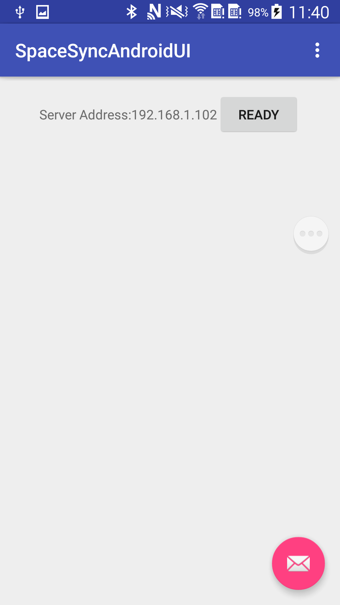
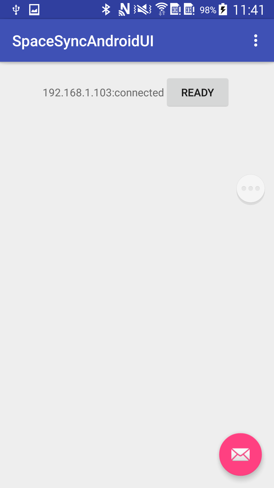
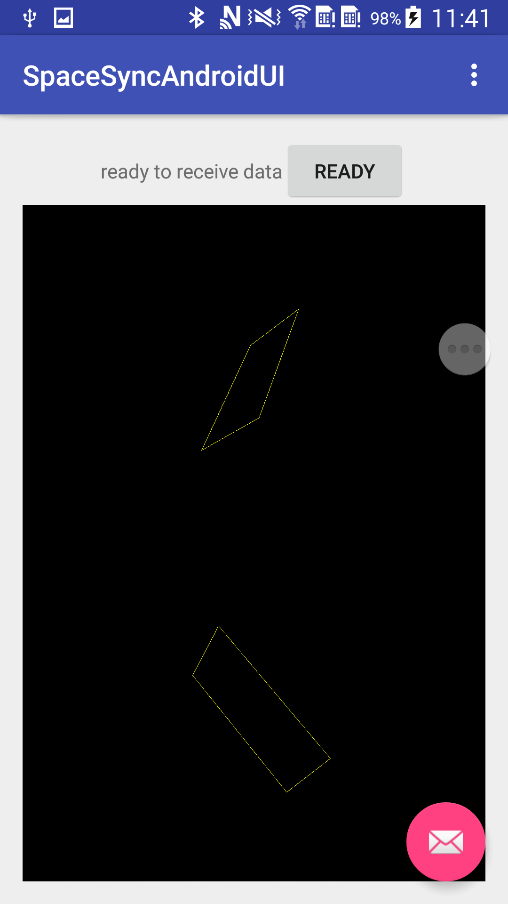

SpaceSync Android Demo
===

# 项目简介
该项目是spacesync 的Android端demo演示，也可用于在电脑上实时观察传感器信号 
# 相关项目
[iSpaceSync](https://github.com/LeoCai/iSpaceSync)
[Multi-Sensor-DataCollector](https://github.com/LeoCai/Multi-Sensor-DataCollector)
[SpaceSync-PC-Demo](https://github.com/LeoCai/SpaceSync-PC-Demo)

关于spacesync请查看[iSpaceSync项目](https://github.com/LeoCai/iSpaceSync/)
#项目配置与依赖

##jar包依赖
* spacesync
* pac_transform

##权限
* wifi
